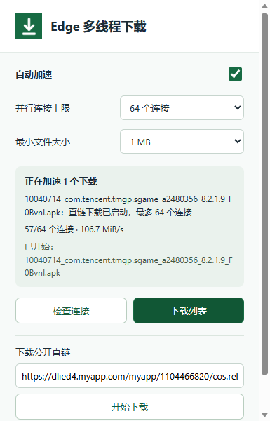
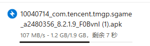
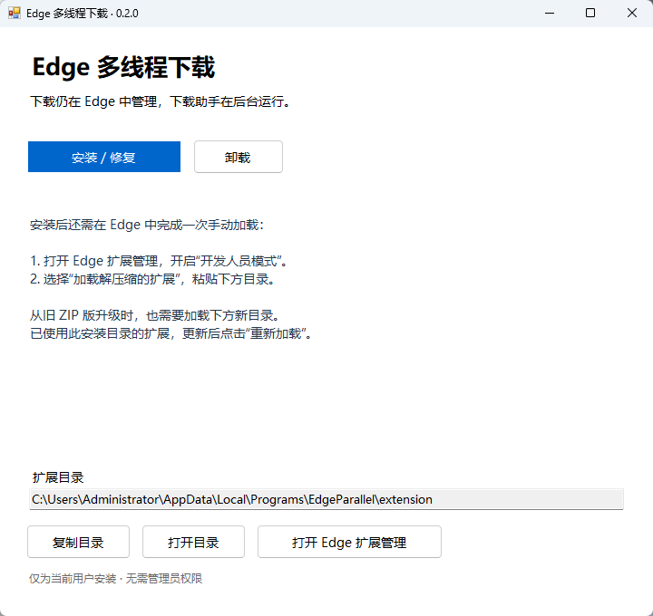

# Edge 多线程下载

为符合条件的公开文件建立多个下载连接，仍在 **Edge 自带下载列表**查看进度、暂停、继续和取消。下载时没有额外窗口。
**是不是厌倦了每次下载都要打开第三方下载器？**
**是不是想追求极致的简约下载体验？**
**是不是想要无感的下载加速？**

**轻松榨干你的宽带**

## 插件界面

## 下载效果

当前版本：**0.2.0** · Windows 10/11 x64 · Microsoft Edge · 使用Codex辅助创作

这是参考 [PCL2](https://github.com/lZiMUl/PCL2) 下载思路的独立实现，与 PCL2 作者及项目无关联，不包含 PCL2 源代码或启动器。

## 安装

1. 在本仓库的 **Releases** 下载 `EdgeParallel-0.2.0-win-x64-setup.exe`，双击打开安装向导。
 
2. 完成安装。向导会提供扩展文件夹路径，可复制路径并打开 Edge 扩展管理页。
3. 在Edge地址栏输入 `edge://extensions` 开启“开发人员模式”，选择“加载解压缩的扩展”，粘贴向导提供的路径并选择该文件夹。
4. 点击扩展图标，再点“检查连接”，看到“已连接”即可使用。

程序仅安装到当前用户的 `%LOCALAPPDATA%\Programs\EdgeParallel`。首次加载扩展需要手动完成，目前未上架 Edge 扩展商店。

## 更新与卸载

**先等正在下载的任务结束并关闭 Edge。** 运行新版安装器更新，再打开 Edge，在 `edge://extensions` 重新加载扩展。

从 0.1.x 旧版迁移时，尤其是曾放在 `EdgeCore` 目录中的版本：安装新版后，在 Edge 移除旧扩展，再加载安装向导给出的新 `extension` 文件夹。旧目录不再作为运行目录，设置可能需要重新调整。不要在下载中途更新、移动文件夹或重新加载扩展。

卸载时先停止加速任务，在 Edge 移除扩展，再到 Windows“设置 → 应用 → 已安装的应用”卸载 **Edge 多线程下载**。已下载的文件不受影响。

## 使用

照常点击文件下载链接。扩展图标出现数字、面板显示正在加速时，表示已接管；“助手已连接”只表示助手可用。未接管时面板会显示原因。

默认 **16 个连接**，加速 **8 MiB 及以上**的文件。可以在面板中调整开关、连接数和文件门槛。更多连接不保证更快。

也可以在面板粘贴无需登录的公开文件直链发起下载。若同一文件已在下载，请先取消旧任务，避免重复传输。

## 使用限制

- 服务器需要支持分段下载，并提供可验证的文件大小与版本。登录下载、表单下载、隐私窗口等情形继续使用 Edge 原生下载。
- 加速文件保存到 **Edge 默认下载目录**，保留原文件名与后缀；同名文件自动加序号。无法继承本次“另存为”选择的路径。
- 关闭 Edge、重新加载扩展或停止助手后，未完成的加速任务可能需要从原网站重新下载。
- 原任务的随机 `.crdownload` 由 Edge 取消任务时处理；助手只清理能准确确认归属的临时文件，无法保证清除 Edge 异常留下的未知文件。
- 速度取决于服务器、网络及本机环境，不保证所有下载都加速或达到 PCL2 的速度。

更多信息见[下载机制与故障排查](docs/DOWNLOADS.md)及[权限与隐私](docs/PRIVACY.md)。

## 源码构建与发布

开发者在 Windows x64 上运行 `scripts/build.ps1` 构建图形安装器。构建所需环境、测试及产物说明见[构建与 GitHub 发布](docs/BUILDING.md)。

GitHub 仓库保存源码；将安装器和 `SHA256SUMS` 作为附件上传到对应版本的 **Releases**。不要把构建缓存、运行时或本机安装文件提交到源码仓库。

原创代码采用 [MIT 许可](LICENSE)。PCL2 参考来源和捆绑运行时许可见[第三方声明](THIRD_PARTY_NOTICES.md)。版本变化见[更新记录](CHANGELOG.md)。
